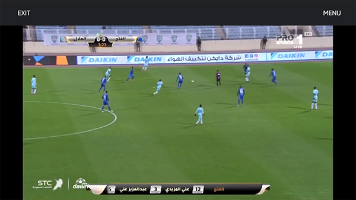
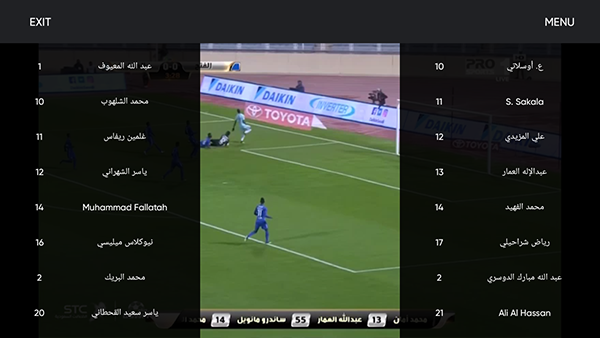

# Android TV-App 

Android TV-App is a sample project to showcases mediaplayer. This app consist of two screens: Splash and mediplayer screen and used MVVM architecture in Android and Clean Architecture 

Media Player class
-------------------------

MediaPlayer.kt class is implemented to handle all cases of SimpleExoPlayer

Creating MediaSource
--------------------

MediaSource, which defines the media to be played, then loads and reads said media. MediaSource is constructed from a MediaSourceFactory, 
creating an ExoPlayer supoorted MediaSource. Currently the fomrate is only for HLS media files.

In the following code shows how create the matching MediaSoruce:

```kotlin

	private fun buildMediaSource(url: String): MediaSource {
        val mediaUri: Uri = Uri.parse(url)
        return HlsMediaSource.Factory(buildDataSourceFactory(BANDWIDTH_METER))
            .createMediaSource(mediaUri)
		
	}

	private fun buildDataSourceFactory(bandwidthMeter: DefaultBandwidthMeter?): DataSource.Factory? {
        return DefaultDataSourceFactory(
            App.getInstance(), bandwidthMeter,
            buildHttpDataSourceFactory(bandwidthMeter)
        )
    }
	
	private fun buildHttpDataSourceFactory(bandwidthMeter: DefaultBandwidthMeter?): HttpDataSource.Factory? {
        val userAgent = Util.getUserAgent(App.getInstance(), BuildConfig.APPLICATION_ID)
        return DefaultHttpDataSourceFactory(userAgent, bandwidthMeter)
    }
	
```

Initialize the Player
----------------------

Once the MediaSource is created, we can call player.prepare(mediaSource).

```kotlin

	private fun initializePlayer() {
        player = ExoPlayerFactory.newSimpleInstance(
            App.getInstance(),
            DefaultTrackSelector(), DefaultLoadControl()
        )
        player?.let {
            it.addListener(this)
            val mediaSource = buildMediaSource(Constants.MEDIA_URL)
            it.prepare(mediaSource, true, false)
            if (playbackPosition != 0L)
                it.seekTo(currentWindow, playbackPosition)
            it.playWhenReady = playWhenReady
        }
    }
	
```

Once our player is ready to play, we can set it to our view. It can either be defined as ExoPlayer's PlayerView widget.
 
```kotlin
 
 playerView.player = mediaPlayer.getSimpleExoPlayer()
 
```

Controlling the player state
----------------------------

The key functions for play and pause, when the instance of the app or activity changes, player status needs to be changed.

When the instance of the app or activity finishes, we also need to release the player with player.release(). If we faile to do so, player to continue running in the background.

```kotlin

    fun onStart() {
        initializePlayer()
    }

    fun onResume() {
        if (player == null)
            initializePlayer()
    }

    fun onStop() {
        releasePlayer()
    }

	private fun releasePlayer() {
        player?.let {
            playbackPosition = it.currentPosition
            currentWindow = it.currentWindowIndex
            playWhenReady = it.playWhenReady
            it.release()
            player = null
        }
    }
```

Player State Callback
---------------------

Player status gives callback to be notified of changes in player state. It can be achievedy by implementing Player.EventListener to MediaPlayer.kt class. This is reqreied to do all necessary changes(Error handling and player buffer) to the player view


Libraries Used
--------------

*  Android Jetpack is used as an Architecture glue including ViewModel, LiveData, Lifecycles, and Navigation.

*  A Android TV-App is written in Kotlin.

*  ExoPlayer is an application level media player for Android, used for playing videos  

*  Dagger 2 is used for architecture level dependency injection.

*  The application does network HTTP requests via Retrofit, OkHttp and GSON.

*  SDP(Scalable dp) to size unit scales with the screen size

*  Anko  to makes code clean and easy to read


Test Library Used
-----------------

*  Espresso for UI test
*  JUnit4 used to test classes

Screenshots
-----------





